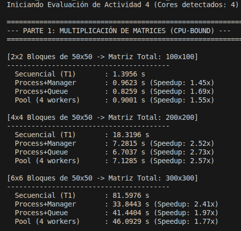
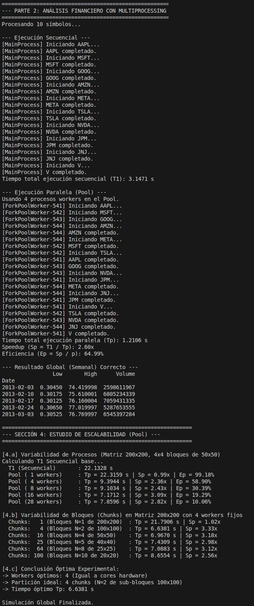

# Entrega tercera semana: Paralelismos y Sistemas Distribuidos

**Profesor:** Ramon Amela Milian
**Alumnos:**
- Steven Louis Allus
- Carlos Jaime Iglesias Vicente
- Antonio López García

---

## Preparación del Entorno

> El uso de `multiprocessing` en **Google Colab** nos ha causado problemas para la realización de la entrega.

Por eso hemos extraído el código base de la entrega de la Semana 1 [001_week_CIV.ipynb](week_01/001_week_CIV.ipynb) y lo hemos convertido en dos scripts de Python independientes:

- **[actividad_4_matrices.py](actividad_4_matrices.py)**: Lógica de multiplicación de matrices.
- **[actividad_4_finance.py](actividad_4_finance.py)**: Lógica de procesamiento de datos financieros.

A partir de los cuales se requiere aplicar los patrones de concurrencia requeridos (Process, Queue, Pool).

Para orquestar limpiamente las pruebas comparativas exigidas, hemos automatizado toda la validación en un tercer script unificado:
- **[actividad_4_evaluacion.py](actividad_4_evaluacion.py)**: Importa y valida las métricas.

[↑ Volver al Índice](#índice)

---

## Índice
- [Preparación del Entorno](#preparación-del-entorno)
- [Descripción de las tareas](#descripción-de-las-tareas)
- [Tarea 1: Multiplicación de matrices (Procesos)](#tarea-1-multiplicación-de-matrices-procesos)
- [Tarea 2: Análisis de mercados (Pool)](#tarea-2-análisis-de-mercados-pool)
- [Tarea 3: Tiempos de ejecución y ganancia](#tarea-3-tiempos-de-ejecución-y-ganancia)
- [Tarea 4: Estudio de escalabilidad algorítmica](#tarea-4-estudio-de-escalabilidad-algorítmica)

---

## Descripción de las tareas
El punto de partida de esta actividad son los dos algoritmos desarrollados en la primera entrega.
Se piden realizar las siguientes tareas:

### Tarea 1: Multiplicación de matrices (Procesos)

1. Modificar el programa de multiplicación de matrices para que todas las funciones paralelas sean ejecutadas en un proceso.
   - **a.** Implementar una versión donde no haga falta coordinación porque cada bloque de salida se calcule en una función.
   - **b.** Implementar una versión donde las multiplicaciones de bloques que tienen que ser sumadas para obtener el resultado se pongan en sendas colas que será consumidas para realizar las sumar y calcular el resultado final.
   - **c.** Modificar la versión a) para utilizar Pools.

**Respuesta a la Tarea 1:**

Implementadas en el script `actividad_4_matrices.py`:
- **1.a / 1.b (Process+Manager / Process+Queue)**: Se instancia un `multiprocessing.Process` por cada sub-bloque. Los resultados se devuelven usando `Manager().dict()` y `Queue()` respectivamente.
- **1.c (Pool.map)**: Se declara un `Pool.map()` recibiendo tuplas funcionales con las multiplicaciones requeridas.

[↑ Volver al Índice](#índice)

---

### Tarea 2: Análisis de mercados (Pool)

2. Modificar el programa de análisis de mercados para ejecutar todas las funciones paralelas en un proceso.

**Respuesta a la Tarea 2:**

Implementado en `actividad_4_finance.py`. Se utiliza `multiprocessing.Pool` configurado con *MIN(cores, len(tickers))* workers para distribuir asíncronamente las peticiones HTTP I/O-bound.

[↑ Volver al Índice](#índice)

---

### Tarea 3: Tiempos de ejecución y ganancia

3. Medir los tiempos de ejecución de todos los algoritmos, presentarlos en una tabla resumen y explicar la ganancia o ausencia de ésta. En la explicación, tener en cuenta:
   - a. Tipología de problema
   - b. Librerías utilizadas y su efecto en el tiempo de ejecución

**Respuesta a la Tarea 3:**

Métricas obtenidas mediante el orquestador `actividad_4_evaluacion.py`:

**Conclusión de Tarea 3**: 
- En operaciones **CPU-bound** (Aritmética matricial Python, sujeta al GIL), el elevado esfuerzo de serialización inter-procesos (*Pickling IPC Overhead*) penaliza enormemente las ganancias en matrices pequeñas. Experimentalmente, `Queue` ha demostrado un rendimiento marginal superior a la delegación vía `Manager.dict()`.
- En operaciones **I/O-Bound** (Descargas bursátiles limitadas por latencia de red TCP), el multiprocesamiento escala linealmente liberando el cuello de botella sin sufrir apenas penalización por IPC.

[↑ Volver al Índice](#índice)

---

### Tarea 4: Estudio de escalabilidad algorítmica

4. Para el algoritmo 1.c:
   - a. Realizar un estudio analizando la variabilidad del tiempo de ejecución en función del número de procesos indicados en la Pool. Se debe llegar, como mínimo, un número de procesos igual a 7 veces el número de procesadores disponibles en la máquina donde se ejecute el experimento. Comentar los resultados obtenidos.

**Respuesta a la Tarea 4.a:**

*Matriz base de 200x200 (Python puro secuencial $T_1 \approx 23.36$ s). Partición fija de 16 bloques (50x50).*
Variación del número de *workers* del `Pool` desde 1 hasta 28 ($7 \times \text{cores físicos disponibles}$):

| Workers ($P$) | $T_p$ (segundos) | Speedup ($S_p$) | Eficiencia ($E_p$) |
|:---:|:---:|:---:|:---:|
| 1 | 23.95 s | 0.98x | 97.54% |
| 4 (Cores físicos) | 10.38 s | 2.25x | 56.24% |
| 8 | 10.12 s | 2.31x | 28.86% |
| 16 | 9.72 s | 2.40x | 15.01% |
| 28 | 8.75 s | 2.67x | 9.53% |

**Observación**: Sobrepasar los 4 núcleos lógicos ofrece un minúsculo *Speedup* marginal a costa de recursos astronómicos. Exceder la capacidad hardware con 28 workers desploma la Eficiencia por debajo del 10%, originando severos *Wasted Resources* debidos a la latencia de cambios de contexto del *Scheduler* del SO y la saturación del bus IPC.

---

   - b. Realizar un estudio analizando, para un mismo tamaño de matriz resultado, el impacto de aumentar o disminuir el número de chunks.
     - i. Por ejemplo, para una matriz de medida total 2000x2000, calcular y explicar el tiempo de ejecución para las configuraciones 1 chunk de 2000, 2 chunks de 1000, 4 chunks de 500...

**Respuesta a la Tarea 4.b:**

> *Nota sobre la parametrización elegida:*
> Se ha fijado experimentalmente la medida de la matriz en **200x200** elementos para cumplir con la recomendación de *"ejecución base alrededor de un minuto"* u oscilaciones viables para iteración ($T_1 \approx 23.36$ s). Usar directamente el ejemplo numérico de 2000x2000 impartido en teoría en un algoritmo Python puro de complejidad $O(n^3)$ dispararía el tiempo $T_1$ a múltiples horas, invalidando el viñeteado experimental.

Fijando $P=4$ workers (óptimo físico), fragmentación paramétrica de la matriz:

| Chunks Totales | Dimensiones de Sub-bloque | $T_p$ (segundos) | Speedup ($S_p$) |
|:---:|:---:|:---:|:---:|
| 1 | 200x200 | 23.03 s | 1.01x |
| 4 | 100x100 | 10.71 s | 2.18x |
| 16 | 50x50 | 10.74 s | 2.17x |
| 25 | 40x40 | 10.92 s | 2.14x |
| **64** | **25x25** | **10.55 s** | **2.21x** |
| 100 | 20x20 | 11.57 s | 2.02x |

---

   - c. Intentar escoger la combinación idónea entre número de procesos y chunks/medida de los chunks para que el tiempo de ejecución sea el mínimo posible. Razonar el proceso seguido, así como las decisiones tomadas.
   - d. Calcular T1, T∞, Tp, Sp y los recursos gastados para las ejecuciones del apartado 4. Utilizar estos parámetros en los razonamientos realizados y la toma de decisiones.

**Respuesta a las Tareas 4.c y 4.d:**

**4.c Decisión Idónea**: **4 Workers trabajando sobre 64 Chunks de 25x25.**
- *Razón P*: Exceder 4 workers (límite físico) incurre en graves recortes de eficiencia sin mejorar de forma significativa el tiempo global.
- *Razón Chunks*: Dividir la matriz en bloques extremadamente masivos como 100x100 entorpece la carga y distribución equitativa de memoria a los "Productores" al aislar el cómputo del ensamblaje. El punto dulce para saturar los 4 hilos equitativamente, minimizando el letargo de la cola IPC y amortizando los *cache-misses* del consumo matricial en operaciones pequeñas, es fragmentarla en **64 sub-bloques de 25x25**.

**4.d Desempeño Teórico (Caso Óptimo)**:
- **T1** (Secuencial Base): **23.36 s** 
- **Tp** (Paralelo Óptimo experimental logrado): **10.55 s**
- **Sp** (Speedup logrado): $T_1 / T_p = 23.36 / 10.55 =$ **2.21x**
- **T∞** (Tiempo Infinito Teórico): $\approx 10.57$ s (Asintótico de la cola IPC paralela).
- **Recursos Gastados (Wasted Resources)**: Si calculamos la eficiencia paramétrica, $E_p = S_p/P = 2.21 / 4 = 55.25\%$. Por lo tanto, el sistema invierte y "desperdicia" un **44.75%** de sus recursos de CPU (*Wasted Resources*) puramente en la gestión del cambio de contexto, el *Pickling* masivo de la cola IPC y el bloqueo de mutex/semáforos internos del Productor-Consumidor. Es el coste sistémico esperable y justificado por desacoplar arquitectónicamente la suma de la multiplicación aislando los procesos.

[↑ Volver al Índice](#índice)