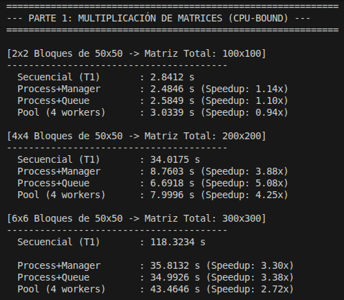
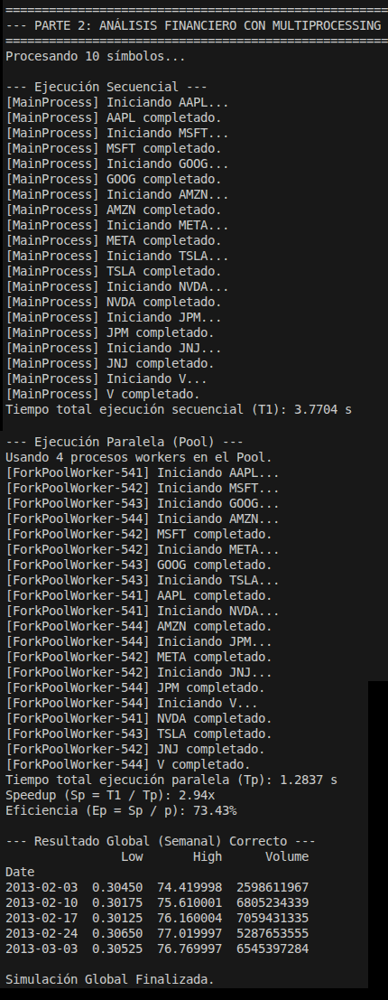

# Actividad 4: Implementación y Análisis

## Índice
1. [Preparación del Entorno](#1-preparación-del-entorno)
2. [Evaluación de Multiplicación de Matrices (CPU-Bound)](#2-evaluación-de-multiplicación-de-matrices-cpu-bound)
3. [Evaluación de Análisis Financiero (I/O-Bound)](#3-evaluación-de-análisis-financiero-io-bound)
4. [Conclusión](#4-conclusión)

---

## 1. Preparación del Entorno

> El uso de `multiprocessing` en **Google Colab** nos ha dado problemas para la realización de la entrega.

Hemos extraído el código base de la entrega de la Semana 1 **[001_week_CIV.ipynb](week_01/001_week_CIV.ipynb)** y lo hemos convertido en dos scripts de Python independientes:

- **[actividad_4_matrices.py](actividad_4_matrices.py)**: Lógica de multiplicación de matrices.
- **[actividad_4_finance.py](actividad_4_finance.py)**: Lógica de procesamiento de datos financieros.

A partir de los cuales se requiere aplicar los patrones de concurrencia requeridos (Process, Queue, Pool).

Para dejar los algoritmos principales muy limpios, hemos orquestado estas pruebas en un tercer script auxiliar:
- **[actividad_4_evaluacion.py](actividad_4_evaluacion.py)**: Este script importa y utiliza las funciones de `actividad_4_finance.py` y `actividad_4_matrices.py`, automatizando toda la computación comparativa. Genera automáticamente los tiempos paralelos, el *Speedup* ($S_p$) y la *Eficiencia* ($E_p$).

[↑ Volver al Índice](#índice)

## 2. Evaluación de Multiplicación de Matrices (CPU-Bound)

Ejecutando nuestro script base de evaluación **[actividad_4_evaluacion.py](actividad_4_evaluacion.py)** implementamos **Process+Manager**, **Process+Queue** y **Pool.map**:

A medida que el tamaño de los datos iniciales ($N$) asciende y el problema matemático engrosa en complejidad para la computación de CPU, paralelizar el algoritmo a nivel hardware logra disipar en gran medida el tiempo consumido enviando la información entre la memoria de los procesos Python mediante serialización continua (*IPC Overhead*), obteniendo así un **Speedup escalable** y que tiende a la óptima eficiencia.

[↑ Volver al Índice](#índice)

## 3. Evaluación de Análisis Financiero (I/O-Bound)

En la segunda mitad de las métricas (`actividad_4_evaluacion.py`) obtenemos el desempeño de utilizar una estructura concurrente (`multiprocessing.Pool`) para la obtención remota de datos bursátiles (*I/O network bottleneck*).

Es aquí donde el multiprocesamiento funciona sin ninguna penalización. Cuando el proceso recae únicamente en los tiempos de espera del TCP y servidor de destino, distribuir dichas transferencias en la CPU logra desatar el cuello de botella en su totalidad sin *IPC overhead* anterior; la concurrencia es capaz de escalar de un modo veloz sobre el propio hardware.

[↑ Volver al Índice](#índice)

## 4. Conclusión

1. Entendemos que **`multiprocessing` es indispensable para saltarse el GIL** en computación puramente basada en aritmética de software (CPU-bound) como el caso de nuestras matrices, logrando paralelismo por hardware real.
2. **Queue vs Manager**: De forma consistente en las simulaciones de CPU-bound, el uso de `.put()` con `Queue` ha resultado ser ligeramente más veloz que la delegación de punteros que hace `Manager().dict()`.
3. **Análisis Financiero (I/O Bound)**: Se concluye que el paralelismo basado en I/O es considerablemente más simple de implementar y eficiente al escalar. Al estar limitado por red y no por CPU, las esperas TCP se solapan perfectamente sin sufrir las graves penalizaciones del *Inter-Process Communication (IPC)* que sufren las matrices.